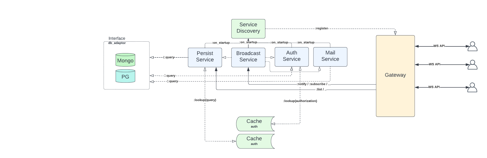

### Notifyx (Notification system)

> Pasecinic Nichita
>
> Distributed systems

#### _Tech Stack_

* `Elixir`
* `Phoenix` framework (REST API for services)
* `:cowboy` (for Gateway WS API)
* `:ets` (for Generic Cache services)
* `Postgres` (will use `Ecto` as db wrapper)
* `MongoDB` (could be used as well, if it will be meaningfully)
* ...

#### _What it does ?_

The user will have the possibility to send notifications, receive them in real time or/and via email, query through its
own notifications (some CRUD operations), apply some filters etc.

[General architecture diagram](https://lucid.app/lucidchart/82c957a4-0db9-49d8-9f8b-dfd44882ce5e/edit?viewport_loc=199%2C-79%2C1993%2C784%2C0_0&invitationId=inv_80e2990b-1b1a-483e-8af2-38e5f92b85af#)

