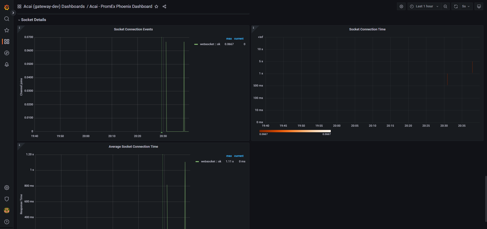
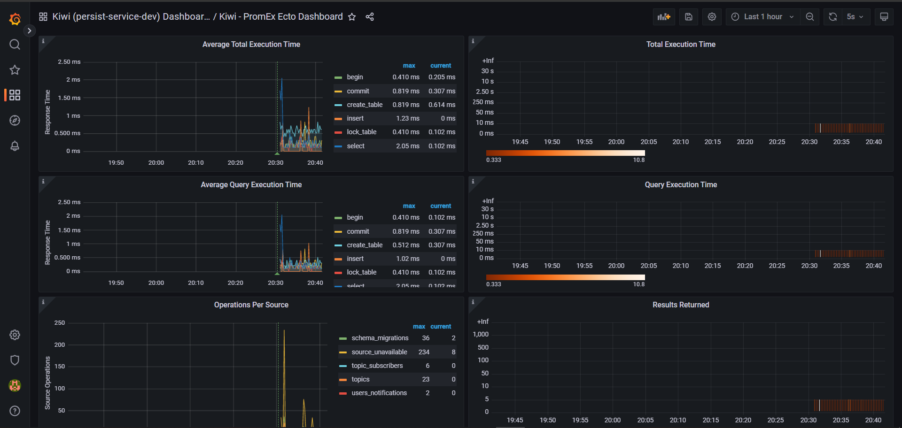

### Configuration files for Grafana & Prometheus Monitoring Stack

Prometheus will scrape Gateway (acai), Auth Service (durian), Persist Service (kiwi) metrics,
for: `Ecto.Repo`, `Phoenix`, `Beam`

To start monitoring the system on local development (services on host machine).
```shell
cd local
docker compose up --build
```

`prod` - config used in main [`docker-compose.yml`](../docker-compose.yml)

### Dashboard Examples

### Prometheus Scrape Targets


### Prometheus Query (Auth Service Ecto metrics)


### Prometheus Graph (Gateway all channel connections - topic join events)


### Grafana (Gateway Beam metrics)


### Grafana (Gateway Channel joins)


### Grafana (Gateway Socket metrics)


### Grafana (Persist Service Ecto general metrics)


### Grafana (Persist Service Ecto query metrics)


### Grafana (Persist Service Ecto - Average query execution time metrics)
